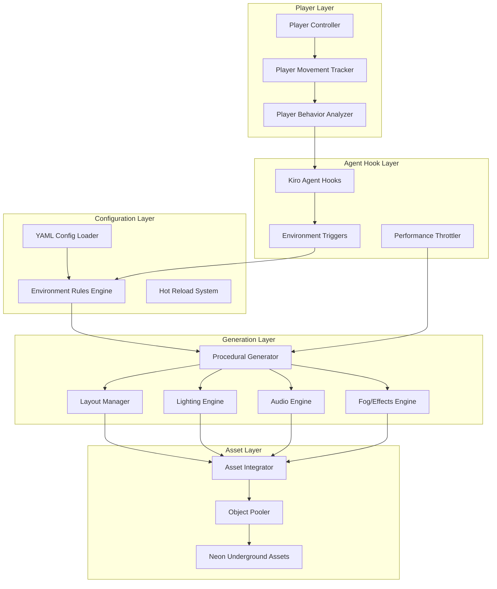

# Design Document

## Overview

The NeonQuest Dynamic Cyberscapes system transforms static Unity environments into reactive, procedurally-generated spaces using a multi-layered architecture. The system combines Unity's built-in systems with Kiro agent hooks, YAML-driven configuration, and real-time procedural generation to create immersive cyberpunk environments that adapt to player behavior.

The core design philosophy centers on **contextual reactivity** - rather than random generation, the system uses player behavior patterns, environmental context, and time-based triggers to make intelligent decisions about how the environment should evolve.

## Architecture



## Components and Interfaces

### 1. Player Behavior System

**PlayerMovementTracker**
- Monitors player position, velocity, and direction
- Calculates movement patterns and dwell times
- Provides spatial context for environmental triggers

**PlayerBehaviorAnalyzer**
- Analyzes movement patterns to predict player intentions
- Identifies exploration vs. backtracking behaviors
- Generates contextual data for procedural systems

### 2. Agent Hook Integration

**KiroAgentHooks**
- Interfaces with Kiro's agent hook system
- Registers callbacks for player behavior events
- Manages hook lifecycle and error handling

**EnvironmentTriggers**
- Defines trigger conditions based on player behavior
- Evaluates YAML-defined rules against current context
- Dispatches generation commands to appropriate systems

### 3. Configuration Management

**YAMLConfigLoader**
```yaml
# Example configuration structure
environment:
  corridors:
    generation_distance: 50.0
    cleanup_distance: 100.0
    variation_seed_factors: [player_speed, time_of_day, zone_type]
  
  lighting:
    neon_response_distance: 5.0
    brightness_multiplier_range: [0.5, 2.0]
    transition_duration: 2.0
  
  atmosphere:
    fog_density_range: [0.1, 0.8]
    ambient_volume_range: [0.3, 0.9]
    transition_speed: 0.1
```

**EnvironmentRulesEngine**
- Parses YAML configurations into runtime rules
- Validates rule consistency and dependencies
- Provides rule evaluation API for trigger systems

### 4. Procedural Generation Core

**ProceduralGenerator**
- Coordinates all generation subsystems
- Manages generation queues and priorities
- Implements performance throttling

**LayoutManager**
- Handles corridor and room generation
- Maintains spatial consistency and connectivity
- Manages asset placement and orientation

**LightingEngine**
- Controls dynamic lighting responses
- Manages neon sign behaviors and effects
- Handles smooth lighting transitions

**AudioEngine**
- Manages ambient sound zones
- Controls dynamic audio mixing
- Handles spatial audio positioning

**FogEffectsEngine**
- Controls fog density and distribution
- Manages particle effects and atmospheric elements
- Handles weather and environmental effects

### 5. Asset Integration

**AssetIntegrator**
- Interfaces with Neon Underground prefab system
- Maintains asset reference integrity
- Handles procedural asset instantiation

**ObjectPooler**
- Manages object lifecycle for performance
- Implements pooling strategies for common assets
- Handles memory cleanup and optimization

## Data Models

### EnvironmentState
```csharp
public class EnvironmentState
{
    public Vector3 PlayerPosition { get; set; }
    public float PlayerSpeed { get; set; }
    public float GameTime { get; set; }
    public string CurrentZone { get; set; }
    public Dictionary<string, float> AtmosphericValues { get; set; }
    public List<GeneratedSegment> ActiveSegments { get; set; }
}
```

### GenerationRule
```csharp
public class GenerationRule
{
    public string RuleName { get; set; }
    public List<TriggerCondition> Conditions { get; set; }
    public List<GenerationAction> Actions { get; set; }
    public float Priority { get; set; }
    public float Cooldown { get; set; }
}
```

### AssetReference
```csharp
public class AssetReference
{
    public string AssetPath { get; set; }
    public GameObject Prefab { get; set; }
    public List<VariationPoint> Variations { get; set; }
    public Dictionary<string, object> Properties { get; set; }
}
```

## Error Handling

### Configuration Errors
- Invalid YAML syntax: Log error, use default configuration
- Missing asset references: Log warning, use placeholder assets
- Conflicting rules: Apply precedence order, warn developer

### Runtime Errors
- Asset loading failures: Use fallback assets, continue operation
- Performance threshold breaches: Reduce generation complexity
- Memory pressure: Trigger aggressive cleanup, reduce active objects

### Agent Hook Errors
- Hook execution failures: Log error, disable problematic hooks
- Communication timeouts: Implement retry logic with exponential backoff
- Invalid hook responses: Validate and sanitize hook data

## Testing Strategy

### Unit Testing
- **Configuration System**: Test YAML parsing, rule validation, hot-reload functionality
- **Generation Algorithms**: Test corridor generation, asset placement, spatial consistency
- **Performance Systems**: Test throttling, object pooling, memory management

### Integration Testing
- **Player Behavior Integration**: Test movement tracking, behavior analysis, trigger activation
- **Asset Integration**: Test Neon Underground asset loading, prefab instantiation, material preservation
- **Multi-System Coordination**: Test coordinated lighting/audio/fog changes

### Performance Testing
- **Frame Rate Stability**: Ensure 60+ FPS during active generation
- **Memory Usage**: Monitor memory growth, test cleanup effectiveness
- **Load Testing**: Test system behavior with rapid player movement and frequent triggers

### End-to-End Testing
- **Player Experience**: Automated tests simulating player movement patterns
- **Environmental Consistency**: Test spatial coherence across generation cycles
- **Configuration Changes**: Test hot-reload behavior and rule application

## Implementation Considerations

### Unity Integration
- Use Unity's Job System for performance-critical generation tasks
- Leverage Unity's Addressable Asset System for efficient asset loading
- Implement custom inspectors for YAML configuration editing

### Kiro Agent Hook Integration
- Design hooks to be stateless for reliability
- Implement proper error boundaries around hook execution
- Use async/await patterns for non-blocking hook communication

### Performance Optimization
- Implement LOD (Level of Detail) systems for distant generated content
- Use object pooling for frequently instantiated assets
- Batch similar operations to reduce draw calls and state changes

### Extensibility
- Design plugin architecture for custom generation modules
- Provide clear APIs for community-created environmental rules
- Support modular asset packs beyond Neon Underground