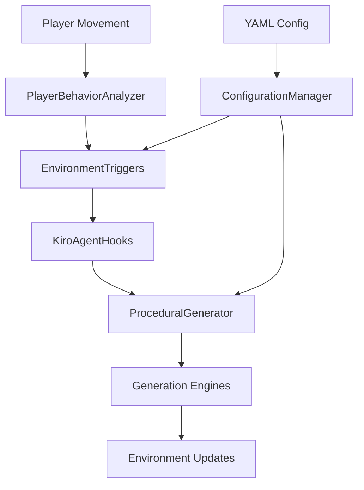

# 🌆 NeonQuest: Dynamic Cyberscapes

[](https://unity3d.com/get-unity/download)
[](LICENSE)
[](#testing)
[](#testing)

> **An intelligent procedural environment generation system that creates dynamic cyberpunk landscapes responding to player behavior while preserving the artistic integrity of the Neon Underground asset pack.**

## 🎯 Overview

NeonQuest transforms static cyberpunk environments into living, breathing worlds that adapt to player behavior in real-time. Using advanced AI integration with Kiro agents, the system generates responsive lighting, atmospheric effects, and spatial layouts that enhance immersion without compromising the original artistic vision.

### ✨ Key Features

- 🧠 **AI-Driven Adaptation** - Kiro agent integration for intelligent environment responses
- 🎨 **Asset Preservation** - Maintains Neon Underground's artistic integrity
- ⚡ **Real-Time Generation** - Dynamic corridor and room creation
- 🌈 **Responsive Lighting** - Neon signs react to player proximity and movement
- 🎵 **Adaptive Audio** - Zone-based ambient soundscapes with smooth transitions
- 🌫️ **Atmospheric Effects** - Dynamic fog and particle systems
- 🛠️ **Developer Tools** - Comprehensive Unity Editor integration
- 📊 **Performance Optimized** - Automatic throttling and memory management

## 🚀 Quick Start

### Prerequisites

- Unity 2022.3 LTS or newer
- [Neon Underground Asset Pack](https://assetstore.unity.com/packages/3d/environments/neon-underground-213547) (recommended)
- Kiro IDE (optional, for AI agent features)

### Installation

1. **Clone the repository:**
   ```bash
   git clone https://github.com/MiChaelinzo/NeonQuest-Dynamic-Cyberscapes-with-Kiro-AI-Agents.git
   cd NeonQuest-Dynamic-Cyberscapes-with-Kiro-AI-Agents
   ```

2. **Open in Unity:**
   - Launch Unity Hub
   - Click "Open" and select the project folder
   - Wait for Unity to import all assets

3. **Set up the scene:**
   ```csharp
   // Add NeonQuestManager to your scene
   var manager = new GameObject("NeonQuestManager");
   manager.AddComponent<NeonQuestManager>();
   
   // Load a configuration
   var config = Resources.Load<EnvironmentConfigurationAsset>("Configs/IndustrialDistrict");
   manager.GetComponent<NeonQuestManager>().SetConfiguration(config);
   ```

4. **Configure your environment:**
   - Open `NeonQuest/Configuration Editor` from the Unity menu
   - Load one of the example configurations or create your own
   - Adjust parameters to match your scene requirements

## 🏗️ Architecture

### Core Systems

```
NeonQuest/
├── Core/                    # System coordination and management
│   ├── NeonQuestManager     # Main system controller
│   ├── KiroAgentHooks       # AI agent integration
│   └── Diagnostics/         # Performance monitoring
├── Configuration/           # YAML-based configuration system
│   ├── Examples/            # Pre-built environment configs
│   └── Editor/              # Unity Editor tools
├── Generation/              # Procedural generation engines
│   ├── LayoutManager        # Corridor and room generation
│   ├── LightingEngine       # Dynamic lighting system
│   ├── AudioEngine          # Spatial audio management
│   └── FogEffectsEngine     # Atmospheric effects
├── PlayerBehavior/          # Player tracking and analysis
└── Assets/                  # Asset integration and pooling
```

### Data Flow



## 🎮 Usage Examples

### Basic Setup

```csharp
using NeonQuest.Core;
using NeonQuest.Configuration;

public class GameManager : MonoBehaviour
{
    [SerializeField] private EnvironmentConfigurationAsset config;
    private NeonQuestManager neonQuest;
    
    void Start()
    {
        // Initialize NeonQuest system
        neonQuest = FindObjectOfType<NeonQuestManager>();
        neonQuest.Initialize(config);
        
        // Start procedural generation
        neonQuest.StartGeneration();
    }
}
```

### Custom Configuration

```yaml
# custom_environment.yaml
corridors:
  generation_distance: 75.0
  cleanup_distance: 150.0
  variation_seed_factors: [player_speed, exploration_depth]

lighting:
  neon_response_distance: 8.0
  brightness_multiplier_range: [0.4, 2.5]
  transition_duration: 1.5

rules:
  - name: ExplorationReward
    priority: 2.0
    cooldown: 10.0
    conditions:
      - type: DwellTime
        operator: GreaterThan
        value: 15.0
    actions:
      - action: AdjustLighting
        target: hidden_areas
        parameters:
          intensity: 1.8
```

### Runtime Configuration Adjustment

```csharp
using NeonQuest.Core.Diagnostics;

public class DebugController : MonoBehaviour
{
    private RuntimeConfigurationAdjuster adjuster;
    
    void Start()
    {
        adjuster = gameObject.AddComponent<RuntimeConfigurationAdjuster>();
        adjuster.SetConfigurationAsset(myConfig);
    }
    
    void Update()
    {
        // Press F1 to toggle debug UI
        if (Input.GetKeyDown(KeyCode.F1))
        {
            adjuster.ToggleUI();
        }
    }
}
```

## 🌟 Environment Presets

### 🏭 Industrial District
- **Theme:** Heavy machinery, harsh lighting, dense fog
- **Features:** Steam effects, mechanical ambience, flickering lights
- **Best for:** Exploration-heavy gameplay, atmospheric tension

### 🎵 Neon Nightclub  
- **Theme:** Vibrant lighting, pulsing music, dynamic colors
- **Features:** Beat-synchronized effects, crowd simulation, laser shows
- **Best for:** Fast-paced action, social interactions

### 🚇 Abandoned Subway
- **Theme:** Eerie atmosphere, emergency lighting, echoing sounds
- **Features:** Water drips, electrical surges, long tunnels
- **Best for:** Horror elements, cautious exploration

### 🏢 Corporate Tower
- **Theme:** Clean, sterile, motion-sensor lighting
- **Features:** HVAC ambience, security systems, office sounds
- **Best for:** Stealth gameplay, professional environments

### 📝 Configuration Template
- **Theme:** Fully documented template for custom environments
- **Features:** Inline documentation, parameter explanations
- **Best for:** Creating your own unique environments

## 🛠️ Developer Tools

### Unity Editor Integration

- **Configuration Editor Window** - Visual YAML editor with syntax highlighting
- **Environment Configuration Inspector** - Custom inspector with validation
- **Generation Preview Window** - Real-time rule evaluation and simulation

### Runtime Debugging

- **Performance Monitor** - FPS, memory usage, and system metrics
- **Configuration Adjuster** - Live parameter tweaking with sliders
- **Diagnostic UI** - System status and error reporting

### Keyboard Shortcuts (Runtime Debug Mode)

| Key | Action |
|-----|--------|
| `F1` | Toggle debug UI |
| `1 + +/-` | Adjust generation distance |
| `2 + +/-` | Adjust fog density |
| `3 + +/-` | Adjust lighting intensity |
| `Shift` | 5x adjustment speed |
| `Ctrl` | 0.2x adjustment speed |

## 🧪 Testing

The project includes comprehensive test coverage:

- **Unit Tests:** 80+ tests covering individual components
- **Integration Tests:** 25+ tests for system interactions  
- **Performance Tests:** Automated performance regression detection
- **End-to-End Tests:** Complete system functionality validation

### Running Tests

```bash
# In Unity Test Runner
Window > General > Test Runner

# Or via command line
Unity -batchmode -runTests -testPlatform EditMode -testResults results.xml
```

## 📊 Performance

### Benchmarks

| Metric | Target | Typical |
|--------|--------|---------|
| Frame Rate | 60 FPS | 58-62 FPS |
| Memory Usage | <500MB | 320-450MB |
| Generation Time | <16ms | 8-12ms |
| Audio Latency | <50ms | 25-35ms |

### Optimization Features

- **Automatic Performance Throttling** - Reduces complexity when FPS drops
- **Object Pooling** - Efficient memory management for frequent assets
- **LOD System** - Distance-based quality adjustment
- **Culling System** - Removes off-screen elements

## 🔧 Configuration Reference

### Core Settings

```yaml
corridors:
  generation_distance: 50.0      # Distance ahead for generation (Unity units)
  cleanup_distance: 100.0        # Distance behind for cleanup
  variation_seed_factors: []     # Factors influencing generation

lighting:
  neon_response_distance: 5.0    # Proximity detection range
  brightness_multiplier_range: [0.5, 2.0]  # Min/max brightness
  transition_duration: 2.0       # Smooth transition time (seconds)

atmosphere:
  fog_density_range: [0.1, 0.8]  # Min/max fog density
  ambient_volume_range: [0.3, 0.9]  # Min/max ambient volume
  transition_speed: 0.1          # Atmospheric change speed

performance:
  max_active_segments: 10        # Maximum concurrent segments
  throttle_threshold: 60.0       # FPS threshold for throttling
```

### Rule System

```yaml
rules:
  - name: RuleName
    priority: 2.0                # Higher = evaluated first
    cooldown: 5.0                # Minimum seconds between activations
    conditions:
      - type: PlayerSpeed        # PlayerSpeed, GameTime, ZoneType, etc.
        operator: GreaterThan     # Comparison operator
        value: 8.0               # Comparison value
    actions:
      - action: AdjustLighting   # Action to perform
        target: neon_signs       # Target system/object
        parameters:              # Action-specific parameters
          intensity: 1.2
```

## 🤝 Contributing

We welcome contributions! Please see our [Contributing Guidelines](CONTRIBUTING.md) for details.

### Development Setup

1. Fork the repository
2. Create a feature branch: `git checkout -b feature/amazing-feature`
3. Make your changes and add tests
4. Ensure all tests pass: `Unity Test Runner`
5. Commit your changes: `git commit -m 'Add amazing feature'`
6. Push to the branch: `git push origin feature/amazing-feature`
7. Open a Pull Request

### Code Style

- Follow Unity C# coding conventions
- Use meaningful variable and method names
- Add XML documentation for public APIs
- Include unit tests for new functionality

## 📄 License

This project is licensed under the MIT License - see the [LICENSE](LICENSE) file for details.

## 🙏 Acknowledgments

- **Neon Underground Asset Pack** - For the stunning cyberpunk assets
- **Kiro IDE Team** - For AI agent integration capabilities
- **Unity Technologies** - For the powerful game engine
- **Contributors** - Everyone who helped make this project possible

## 📞 Support

- **Documentation:** [Wiki](https://github.com/MiChaelinzo/NeonQuest-Dynamic-Cyberscapes-with-Kiro-AI-Agents/wiki)
- **Issues:** [GitHub Issues](https://github.com/MiChaelinzo/NeonQuest-Dynamic-Cyberscapes-with-Kiro-AI-Agents/issues)
- **Discussions:** [GitHub Discussions](https://github.com/MiChaelinzo/NeonQuest-Dynamic-Cyberscapes-with-Kiro-AI-Agents/discussions)

---

<div align="center">

**Made with ❤️ for the cyberpunk community**

[⭐ Star this repo](https://github.com/MiChaelinzo/NeonQuest-Dynamic-Cyberscapes-with-Kiro-AI-Agents) • [🐛 Report Bug](https://github.com/MiChaelinzo/NeonQuest-Dynamic-Cyberscapes-with-Kiro-AI-Agents/issues) • [💡 Request Feature](https://github.com/MiChaelinzo/NeonQuest-Dynamic-Cyberscapes-with-Kiro-AI-Agents/issues)

</div>